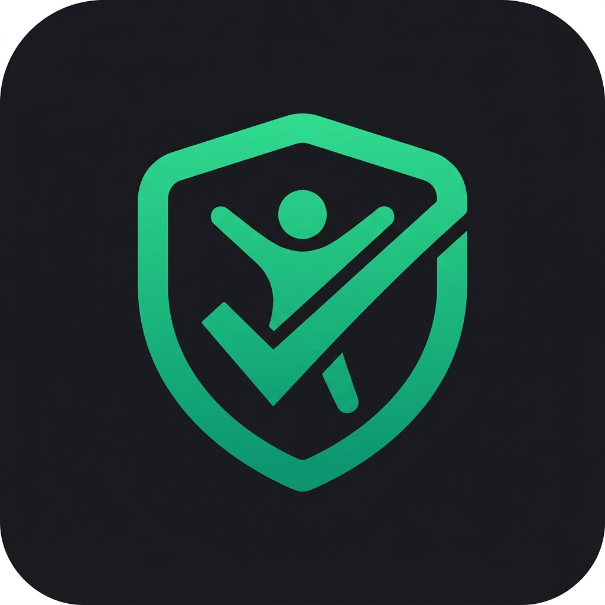

<div align="center">
  
  <h1>AuditLevel</h1>
  <p><strong>Acessibilidade feita na raiz do código, não no final do sprint.</strong></p>

  <p>
    <a href="#como-funciona">Como Funciona</a> •
    <a href="#por-que">Por que usar</a> •
    <a href="#recursos">Recursos</a> •
    <a href="#numeros">Números</a> •
    <a href="#quick-start">Quick Start</a>
  </p>

  <br/>

  
  
  
</div>

<br/>

## O Problema

> **18% da população brasileira** tem algum tipo de deficiência. Ignorar acessibilidade digital significa excluir 1 em cada 5 usuários — e expor sua empresa a multas de até **R$ 50.000** por não conformidade com a [LBI (Lei 13.146/2015)](http://www.planalto.gov.br/ccivil_03/_ato2015-2018/2015/lei/l13146.htm).

A maioria das equipes descobre problemas de acessibilidade **tarde demais**: no Lighthouse, na auditoria manual, ou pior — através de uma notificação do Ministério Público.

## A Solução

O **AuditLevel** é um servidor [MCP (Model Context Protocol)](https://modelcontextprotocol.io) que se integra diretamente ao seu agente de IA favorito. Ele audita e corrige violações de acessibilidade **em tempo real**, enquanto o código está sendo gerado.

```
Você escreve o prompt → IA gera o código → AuditLevel audita → IA corrige → Código acessível na primeira entrega
```

Sem plugin de IDE. Sem etapa extra. Sem retrabalho.

---

<h2 id="como-funciona">⚙️ Como Funciona</h2>

<table>
<tr>
<td width="33%" align="center">
<h3>1. Você faz o prompt</h3>
<code>"Crie um formulário de login acessível"</code>
<br/><br/>
No seu fluxo normal com Claude, Cursor, Copilot ou qualquer agente MCP-compatível.
</td>
<td width="33%" align="center">
<h3>2. IA chama o AuditLevel</h3>
<code>tool_call: AuditLevel_Analyze(component)</code>
<br/><br/>
O agente invoca automaticamente o servidor MCP local para auditar o resultado.
</td>
<td width="33%" align="center">
<h3>3. Código corrigido</h3>
<code>{ violations: 0, score: 98 }</code>
<br/><br/>
O agente recebe o relatório e corrige antes de entregar o componente final.
</td>
</tr>
</table>

---

<h2 id="por-que">🎯 Por que AuditLevel?</h2>

| Abordagem Tradicional | Com AuditLevel |
|---|---|
| Auditoria manual pós-deploy | Auditoria em tempo real durante a geração |
| R$ 800–2.000 por auditoria externa | Incluído no fluxo, sem custo adicional |
| 3h por componente para revisão | Segundos, automatizado pela IA |
| Correções em sprints separados | Código já nasce acessível |
| Desenvolvedor precisa ser especialista em a11y | IA aplica as correções com base no relatório |

---

<h2 id="recursos">🛡️ Recursos</h2>

- **Análise WCAG 2.2 completa** — Cobre ~87% dos critérios de sucesso, incluindo todos de nível A e AA
- **Integração invisível via MCP** — Funciona com Claude, Cursor IDE, Windsurf, Continue.dev e VS Code
- **Execução 100% local** — Seu código nunca sai da máquina. Zero risco de vazamento
- **Framework-agnostic** — React, Vue, Angular, Svelte, HTML puro — analisa o output semântico
- **Relatório estruturado** — JSON com violações, critério WCAG, severidade e sugestão de correção
- **Checklist para critérios manuais** — Para os ~13% que exigem julgamento humano

---

<h2 id="numeros">📊 Números que importam</h2>

| Métrica | Valor |
|---|---|
| Multa média por não conformidade WCAG | **R$ 50.000** |
| Horas de dev economizadas por sprint | **18h** |
| Economia vs auditoria manual anual | **R$ 28.000** |
| Critérios WCAG 2.2 cobertos automaticamente | **87%** |
| Aumento médio em conversão com a11y | **+23%** |
| População brasileira com deficiência | **18% (~38M pessoas)** |

---

<h2 id="quick-start">🚀 Quick Start</h2>

### 1. Instale o servidor MCP

```bash
npm install -g @auditlevel/mcp-server
```

### 2. Configure seu agente de IA

Adicione ao `mcp_config.json`:

```json
{
  "mcpServers": {
    "auditlevel": {
      "command": "auditlevel-mcp",
      "args": ["--wcag-level", "AA"]
    }
  }
}
```

### 3. Comece a usar

Faça qualquer prompt normalmente. O AuditLevel entra em ação automaticamente quando o agente gera ou revisa componentes de UI.

---

## 🔌 Compatibilidade

| Agente de IA | Status |
|---|---|
| Claude (Anthropic) | ✅ Nativo |
| Cursor IDE | ✅ Nativo |
| Windsurf | ✅ Nativo |
| Continue.dev | ✅ Nativo |
| VS Code + extensão MCP | ✅ Suportado |
| GitHub Copilot | 🔜 Em roadmap (via bridge) |

---

## 🔒 Privacidade e Segurança

- O servidor MCP roda **100% local** (localhost)
- **Nenhum código** é enviado para servidores externos
- Comunicação com nossos servidores apenas para validação de licença (planos pagos)
- Telemetria anônima de uso **pode ser desativada**

---

## 🏗️ Stack da Landing Page

| Tecnologia | Uso |
|---|---|
| React 19 + TypeScript | UI |
| Tailwind CSS v4 | Estilização |
| Framer Motion | Animações |
| Vite 8 | Bundler |
| Phosphor Icons | Iconografia |

### Desenvolvimento local

```bash
npm install
npm run dev
```

### Build

```bash
npm run build
```

---

<div align="center">
  <br/>
  <p><strong>AuditLevel</strong> — Acessibilidade não é feature. É requisito.</p>
  <br/>
  <a href="https://auditlevel.com">
    
  </a>
</div>
